# Programming and Laboratory Project, A.Y. 2024/2025

This project involves implementing a simplified version of the classic game [Tetris](https://www.lumpty.com/amusements/games/tetris/tetris.html), focusing on the fundamental operations of (1) parsing pieces recursively from an input stream, and (2) inserting those pieces in the Tetris grid.

The project requires to implement two classes, `piece` and `tetris`, as described in this document.

### Table of contents

1. [The `piece` class](#piece)
2. [The `tetris` class](#tetris)
3. [How to Test Your Code?](#testing)
4. [Project Submission](#submission)
5. [Project Evaluation](#evaluation)
6. [GitHub Issues](#issues)

## 1. The `piece` class <a name="piece"></a>

The `piece` class represents an individual Tetris piece within the game.

```
struct piece {
   (...)
private:
    uint32_t m_side;
    uint8_t m_color;
    bool** m_grid;
};
```

It is implemented as a **squared matrix of boolean values**, `m_grid`, where cell `(i,j)` (`j`-th value from the `i`-th row) is `true` if the cell is filled or `false` otherwise.

For example, the following is a 4 x 4 grid

<p align="center">
  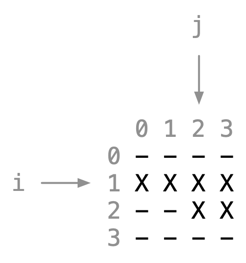
</p>

where `X` indicates a `true` value and `-` indicates a `false` value.
So we have `(0,0)=(0,1)=(0,2)=(0,3)=false`, `(1,0)=(1,1)=(1,2)=(1,3)=true`, `(2,0)=(2,1)=false`, `(2,2)=(2,3)=true`, and `(3,0)=(3,1)=(3,2)=(3,3)=false`.

The class has of the following attributes:

- **Color**: Each piece is assigned a color, `m_color`, represented as a `uint8_t` value (ranging from 1 to 255; 0 is not a valid color). This attribute is useful when printing the game to your terminal because it visually distinguishes the piece from the other pieces in the game (assuming the other pieces have a different color).

	To write the cell (i,j) to the output stream `os`, use the following code snippet.

	```
    if (m_grid[i][j]) {
        os << "\033[48;5;" << int(m_color) << "m" << ' ' << "\033[m";
    } else {
        os << ' ';
    }
	```

	For example, here is how the previous 4 x 4 grid will be printed on a terminal (hence `os` is `std::cout`), assuming the color is `221` (yellow). White dashes are used to draw the grid's borders.

<p align="center">
  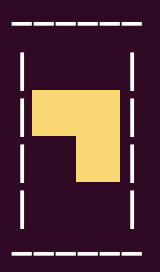
</p>

- **Side Length**: The side of the grid is represented by a `uint32_t` value, which must be a power of 2 (e.g., 1, 2, 4, 8, etc.).

- **Grid**: The piece contains a dynamically allocated, squared, 2D array of booleans, `bool** m_grid`, which represents the shape of the Tetris piece.

### Recursive Input Format

The recursive input format for a piece is designed to succinctly represent shapes through a hierarchical structure.

The format begins with an integer specifying the side length of the grid, followed by an integer specifying the color (1-255), followed by the recursive structure of the grid.
In general terms, the grid is expressed as a quadruple which stores the four quadrants in the following order: top-left (TL), top-right (TR), bottom-left (BL), and bottom-right (BR).

Specifically, a quadrant can be one of the following three things:

- **`()`**: Full quadrant.

- **`[]`**: Empty quadrant.

- **`(TL TR BL BR)`**: If a set of parentheses contains content, it indicates that further recursion occurs. This signifies the presence of smaller quadrants, in order from left-to-right, top-bottom: top-left (`TL`), top-right (`TR`), bottom-left (`BL`), and bottom-right (`BR`), that can be further divided.

For instance, the string

```
4 75 (([]()[]())(()[]()[])([]()()())(()[]()()))
```

corresponds to the following 4 x 4 grid (with associated color 75)

```
  0 1 2 3
0 - X X -
1 - X X -
2 - X X -
3 X X X X
```

and the string

```
2 75 ()
```

corresponds to the 2 x 2 grid (with associated color 75)

```
  0 1
0 X X
1 X X
```

Figure 1 illustrates a detailed, 8 x 8, graphical example.

<p align="center">
  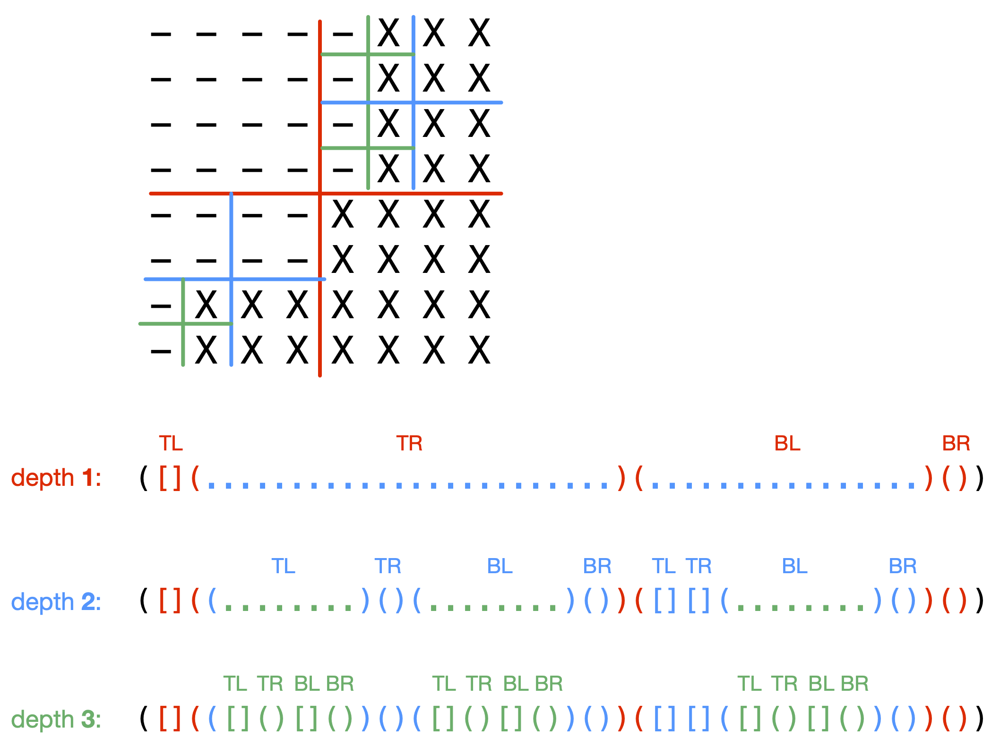
  <br> Figure 1: A 8 x 8 piece. Different colors highlight the recursive decomposition of the grid.
</p>

**Note 1:** A side length $s$ allows, *at most*, $\log_2(s)$ levels of recursion.

**Note 2:** The input format can contain an arbitrary number of whitespace characters (` `, `\n`, `\t`, etc.). The parser must ignore those characters as seen during lectures. For example, the following

```
  4 	75  
    ( (
 [ ]()[
 ]()) (( )[
 ]()[])([](
 )()(  )) ( ()[](
  )() ) )
```

is a valid input format for the piece (with associated color 75)

```
  0 1 2 3
0 - X X -
1 - X X -
2 - X X -
3 X X X X
```

Let us now consider the methods of the `piece` class.

### Constructors and Destructor

  - `piece()`: Default constructor, initializes an empty piece (i.e., `empty()` must be true after the constructor) with `s=0`, `c=0`, and `m_grid=nullptr`.
  - `piece(uint32_t s, uint8_t c)`: Constructs an empty piece (i.e., `empty()` must be true after the constructor) with side length `s` (must be a power of 2) and color `c`. Throws `tetris_exception` if `s` is not a power of 2, or if `c` is 0. To determine if an integer `s` is a power of 2, you could for example implement a simple iterative algorithm.
  - `piece(piece const& rhs)`: Copy constructor, creates a deep copy of `rhs`.
  - `piece(piece&& rhs)`: Move constructor, transfers ownership from `rhs` to the new piece.
  - `~piece()`: Destructor, releases allocated memory.

### Assignment Operators

  - `piece& operator=(piece const& rhs)`: Copy assignment, duplicates the contents of `rhs`.
  - `piece& operator=(piece&& rhs)`: Move assignment, transfers ownership from `rhs`.

### Access and Mutators

  - `uint32_t side() const`: Returns the side length of the piece.
  - `int color() const`: Returns the color of the piece.
  - `bool operator()(uint32_t i, uint32_t j) const`: Returns the cell value at (i,j). Throws `tetris_exception` if (i,j) is out of bounds.
  - `bool& operator()(uint32_t i, uint32_t j)`: Returns a reference to the cell (i,j). Throws `tetris_exception` if (i,j) is out of bounds.

### Piece Operations

  - `bool empty(uint32_t i, uint32_t j, uint32_t s) const`: Checks if a square of side `s` whose top-left corner is at (i,j) is empty. Throws `tetris_exception` if out of bounds.
  - `bool full(uint32_t i, uint32_t j, uint32_t s) const`: Checks if a square of side `s` whose top-left corner is at (i,j) is full.
  - `bool empty() const`: Returns `true` if and only if if the boolean matrix of the piece contains only `false` values.
  - `bool full() const`: Returns `true` if and only if if the boolean matrix of the piece contains only `true` values.

  **Note:** The methods `empty(i,j,s)` and `full(i,j,s)` are useful to write the piece is the recursive format to an output stream (see below).

  - `void rotate()`: Rotates the piece 90 degrees clockwise, that is, cell `(i,j)` becomes the cell `(j,m_side-i-1)` in the rotated piece's grid.

  For example, consider the following piece.

<p align="center">
  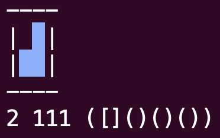
</p>

  Then, these are the three consecutive rotations of the piece.

<p align="center">
  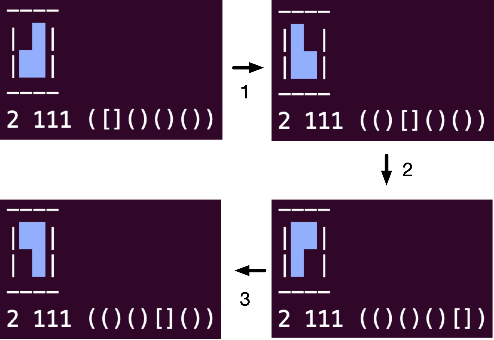
</p>

  - `void cut_row(uint32_t i)`: Removes row `i` from the piece, shifting rows above it down by **one** row.

  For example, if we cut row `i=1` from the following piece, apart from setting cell `(1,j)=false` for all `j=0..m_side-1`, cell (0,2) "shifts" down to take the place of the cell (1,2).

<p align="center">
  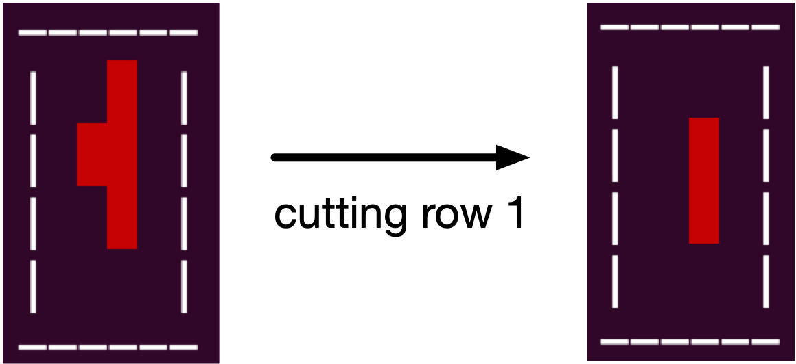
</p>

  - `void print_ascii_art(std::ostream& os) const`: Write an ASCII representation of the piece to output stream, using the attribute `m_color` as explained above. **Hint:** Call this function as `p. print_ascii_art(std::cout);` where `p` is a piece.

**Note**: We will never test the function `void print_ascii_art(std::ostream& os) const` in our own tests, but we recommend to implement it for debugging your own code. Importantly (read also below), do not write "std::cout" in your code: we will reject any code containing printing statements, like those involving `std::cout`, `printf`, etc. Be sure your code does not print anything!

### Comparison Operators

  - `bool operator==(piece const& rhs) const`: Returns true if the boolean matrices of the pieces are identical and color is the same.
  - `bool operator!=(piece const& rhs) const`: Returns true if the boolean matrices of the pieces are not identical or color is not the same.

Note that this takes into account the **rotation** of the pieces.
For example, the following pieces are to be considered **different** pieces although the second is the rotation of the first.

<p align="center">
  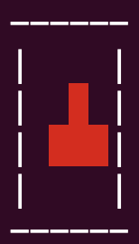

  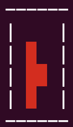
</p>

### I/O Operations

- `std::istream& operator>>(std::istream& is, piece& p)`: Reads a piece from an input stream. It throws `tetris_exception` is the input is not formatted properly. It is your responsibility to detect as many errors as possible (e.g., unexpected character, missing side length, etc.).

- `std::ostream& operator<<(std::ostream& os, piece const& p)`: Writes a piece to an output stream.
The format must be `side color grid`, where the output format for `grid`
must be identical to the input format described above. For example, the piece

```
-XX-
-XX-
-XX-
XXXX
```
will be written to an output stream as

```
4 75 (([]()[]())(()[]()[])([]()()())(()[]()()))
```

where `4` is the side length, and assuming that `75` is the integer representing the color of the piece. The string is the recursive representation of its grid.

## 2. The `tetris` class <a name="tetris"></a>

The `tetris` class represents the Tetris game board, handling piece placement and game logic. The class skeleton is as follows.

```
struct tetris_piece {
    piece p;
    int x;
    int y;
};

class tetris
{
    struct node {
        tetris_piece tp;
        node* next;
    };
public:
	(...)
private:
    uint32_t m_score;
    uint32_t m_width;
    uint32_t m_height;
    node* m_field;
};
```

It maintains a (singly) linked-list of nodes, `m_field`, where each node incapsulate a triple `(p,x,y)` (called `tetris_piece`), meaning that `p` is the piece whose **bottom-left** corner is at position (x,y) in the tetris field of size `m_width x m_height`. The attribute `m_score` (initially 0) represents the score of the game: it is incremented by `m_width` when a row becomes full (and eliminated; see next).

For example, the following is an empty 8 x 6 field.

<p align="center">
  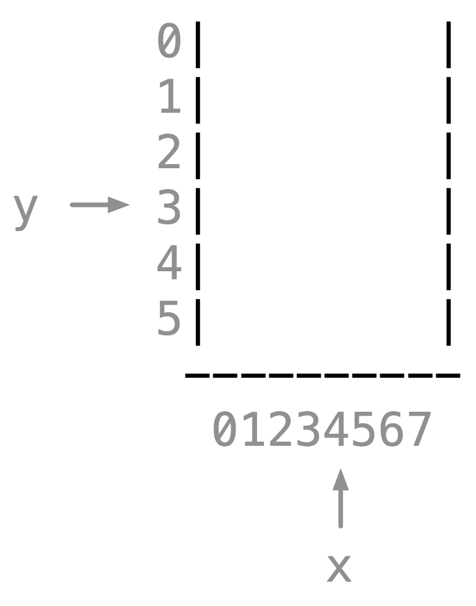
</p>

Now, instead, we have four pieces in the field, each with its bottom-left `(x,y)` coordinate computed relative to the field.

<p align="center">
  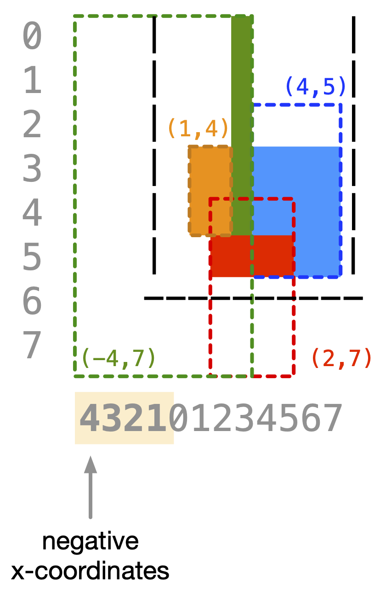
  <br> Figure 2: Four pieces in a 8 x 6 Tetris field.
</p>

**Important note:** The x-coordinate for a piece can be negative, as it happens for the green piece in the previous example. The y-coordinate for a piece, on the other hand, can never be negative: recall that the coordinate (x,y) of a piece refers to its bottom-left cell. 

### Constructors and Destructor

  - `tetris()`: Default constructor, initializes an empty game board, with `m_score=m_width=m_height=0` and `m_field=nullptr`.
  - `tetris(uint32_t w, uint32_t h, uit32_t s)`: Constructs a game board with width `w`, height `h`, and score `s`. Throws `tetris_exception` if a dimension is 0.
  - `tetris(tetris const& rhs)`: Copy constructor, duplicates the game state.
  - `tetris(tetris&& rhs)`: Move constructor, transfers the game state from `rhs`.
  - `~tetris()`: Destructor, deallocates resources.

### Assignment Operators

  - `tetris& operator=(tetris const& rhs)`: Copy assignment operator.
  - `tetris& operator=(tetris&& rhs)`: Move assignment operator.

### Comparison Operators

  - `bool operator==(tetris const& rhs) const`: Returns true if both Tetris games are identical (i.e. if all member variables of the two tetris containers are equal).
  - `bool operator!=(tetris const& rhs) const`: Returns true if the games differ.

### Game Operations

- The query `bool containment(piece const& p, int x, int y) const`
checks if piece `p`, positioned at offset `(x,y)`, can be fully contained within the Tetris field and its filled cells do not intersect with other pieces.

- The `void add(piece const& p, int x, int y)` operation adds the piece `p` with offset `(x,y)` to the front of the list. It throws `tetris_exception` if `p` cannot be contained at offset `(x,y)` (i.e., `containment(p,x,y)==false`). This function can be used when implementing `operator>>` (see next).

- The `void insert(piece const& p, int x)` operation is where
most of the game logic happens. It inserts a piece `p` whose x-coordinate in the field is `x` and,
if possible, cut rows and shifts other pieces further down in the field.

  This method first computes the y-coordinate for the piece.
  Note that this task reduces to that of asking `containment` queries:
  if `p` can be contained at offset `(x,y)`, then try offset `(x,y+1)`,
  then `(x,y+2)`, etc., until you determine the largest possible `y`-coordinate for `p`.

  The method throws a `tetris_exception` if the piece cannot be placed ("GAME OVER").

  Otherwise, the piece is added to the **front** of the list. (Preserving the order of pieces
  is important to implement comparison operations.)

  Also, if row `r` in the tetris field becomes full, it must be cut, i.e., by calling `p.cut_row(r)` for every piece `p` that "crosses" row `r`.
  In this case, the score of the game increases by `m_width`.

  If, after cutting one or more rows, some piece becomes empty (i.e., `piece::empty()` returns `true`),
  then it must be removed from the list.

  Note that, after cutting rows, not only some pieces might become empty
  (and, thus, have to be removed) but other pieces might be further shifted down
  in the field.

  These considerations suggest the following implementation for `insert(p,x)`:

	    insert(p,x):
	      1. compute y for piece p
	      2. if p cannot be placed, then GAME OVER
	      3. otherwise, add (p,x,y) to the front of the list
	      4. until we can cut rows or pieces can shift further down, do:
	          4.1 cut rows
	          4.2 delete empty pieces (if any)
	          4.3 shift pieces further down (if possible)

- `void print_ascii_art(std::ostream& os) const`: Write an ASCII representation of the game board to output stream, showing the current state of the game including all pieces.

  For example, the following could be the output on the terminal of the field represented in Figure 2.

<p align="center">
  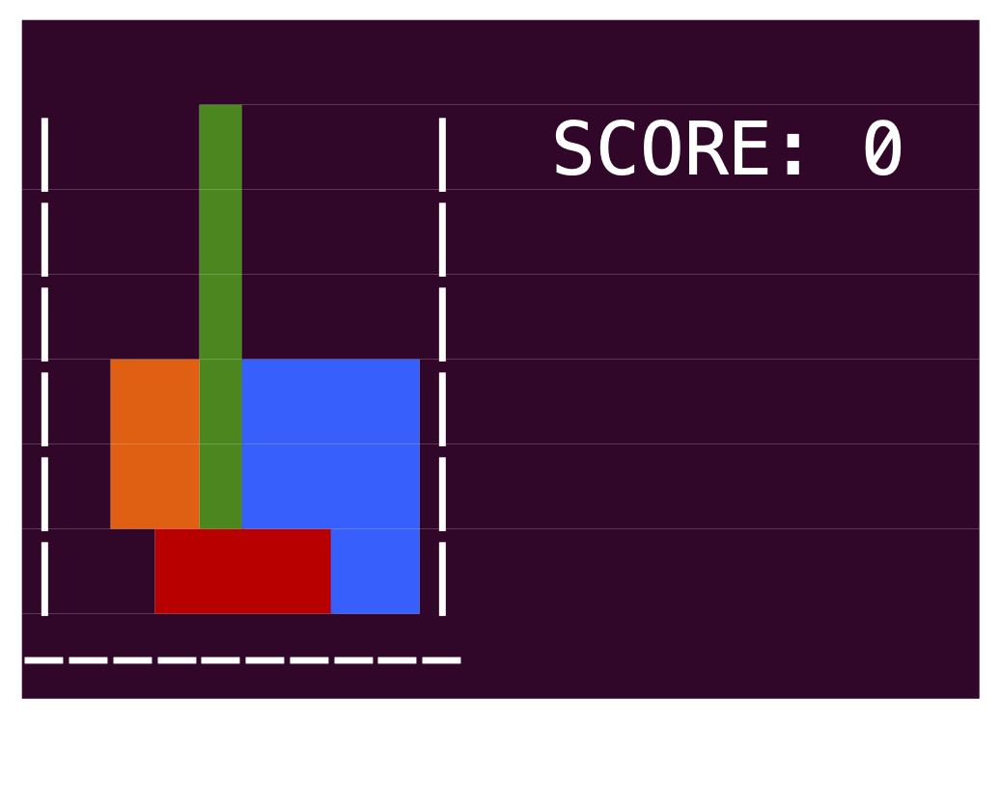
</p>

  As already noted for the class `piece`, we will never test the function `void print_ascii_art(std::ostream& os) const` in our own tests: this is only useful to get a graphical output.

Now, let us consider the following examples, when we insert more pieces to the game above (Figure 2).

<p align="center">
  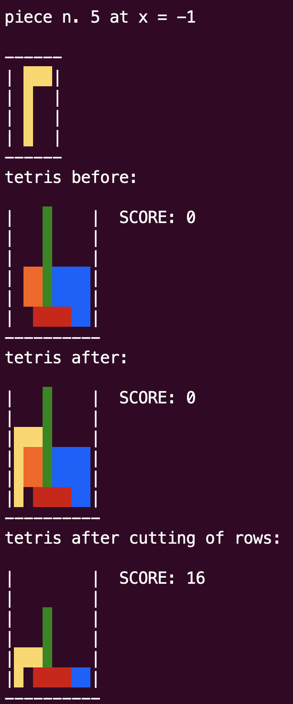
</p>

<p align="center">
  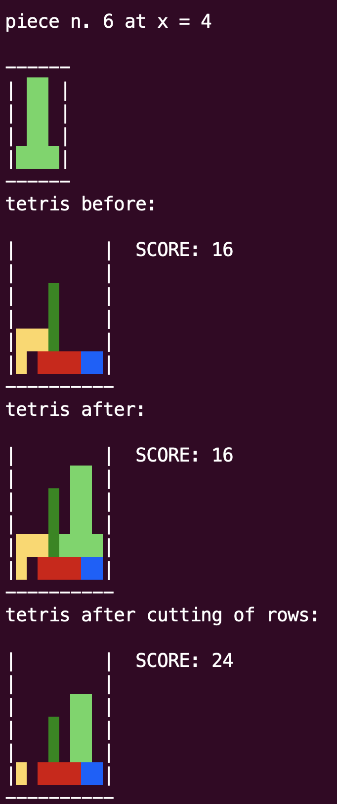
</p>

<p align="center">
  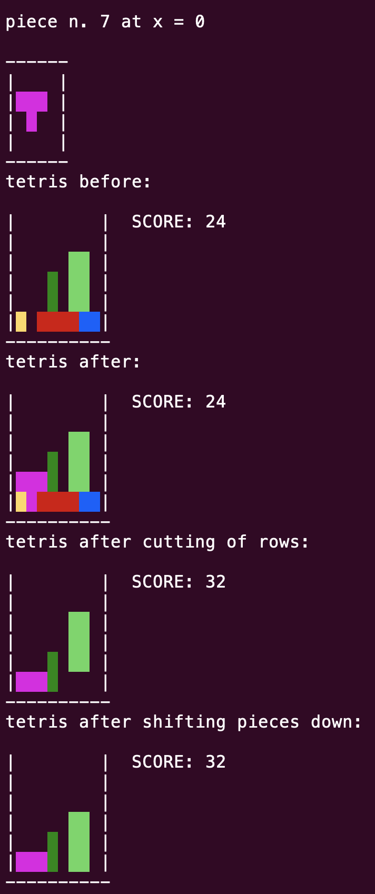
</p>

<p align="center">
  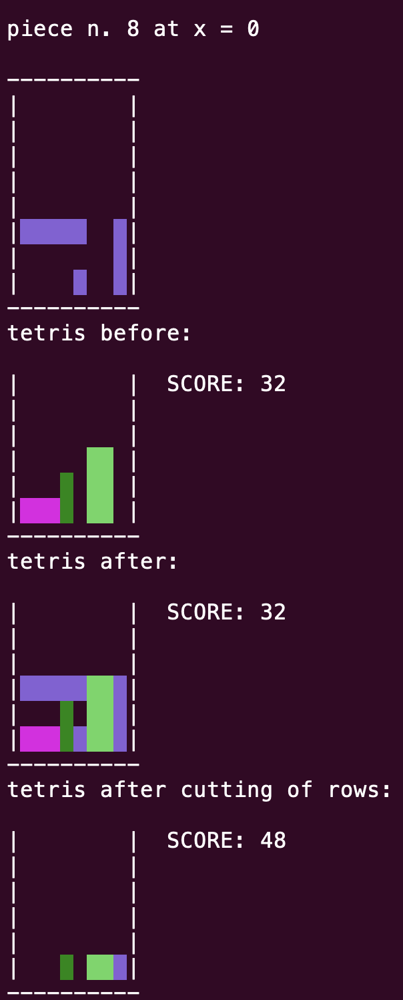
</p>

### Iterators

The `tetris` class has the following sub-class (and another similar one for `const_iterator`) representing an iterator over its pieces.

```
struct iterator {
    using iterator_category = std::forward_iterator_tag;
    using value_type = tetris_piece;
    using reference = tetris_piece&;
    using pointer = tetris_piece*;

    iterator(node* ptr);
    reference operator*();
    pointer operator->();
    iterator& operator++();
    iterator operator++(int /*dummy*/);
    bool operator==(iterator const& rhs) const;
    bool operator!=(iterator const& rhs) const;

private:
    node* m_ptr;
};
```

Hence, the `tetris` class exposes the following methods.

- `iterator begin()`: Returns an `iterator` object to the beginning of the piece list.
- `iterator end()`: Returns an `iterator` object to the end of the piece list.
- `const_iterator begin() const`: Returns a `const_iterator` object to the beginning of the piece list.
- `const_iterator end() const`: Returns a `const_iterator` object to the end of the piece list.

### Getters

- `uint32_t score() const`: Returns the current game score.
- `uint32_t width() const`: Returns the width of the game grid.
- `uint32_t height() const`: Returns the height of the game grid.

### I/O Operations

- `std::ostream& operator<<(std::ostream& os, tetris const& t)`: Writes the Tetris game's details to an output stream in following format:
`score width height \n p1 x1 y1 \n p2 x2 y2 \n ...`
where `pi` is `i`-th piece, and `(xi,yi)` its coordinate
in the tetris field, **in the order read from the list**
(remember: pieces are inserted to the front of the list; a deletion does not change the order of the other pieces).

	For example, the following is the output of the Tetris game of Figure 2, assuming pieces were inserted in this order: red, blue, green, orange.

```
0 8 6
2 202 () 1 4
8 28 ([]([]([]()[]())[]([]()[]()))[]([]([]()[][])[][])) -4 7
4 27 (([][]()())([][]()())(()()[][])()) 4 5
4 160 (([][]()())([][]()())[][]) 2 7
```

- `std::istream& operator>>(std::istream& is, tetris& t)`: Reads a Tetris game from an input stream, assuming the input is formatted as 
`score width height \n p1 x1 y1 \n p2 x2 y2 \n ...`
where `pi` is `i`-th piece, and `(xi,yi)` its coordinate
in the tetris field, **in the order read from the list** (as explained above).

## 3. How to Test Your Code? <a name="testing"></a>

Remember the general rule: writing code is only half the job! The other half consists of designing thorough tests to detect any bugs. During evaluation, our task will be to stress your code (by testing it on various files, both in valid format and not, and combining operators in every possible way), so create great tests and remember to compile the code with the debugging tools shown in class (assert and compiler sanitizers). Also, be sure to use Valgrind.

That said, we recommend creating a file `tools/test.cpp` where you will define a `main` function that tests the `piece` and `tetris` objects you have written. This `test.cpp` file **must not** be submitted (you should submit `tetris.cpp` only, see below); it is only for your use to test your code. Test each method of `piece` and `tetris` in isolation, using many test cases.

Ensure that there are no memory leaks. Valgrind's output should always conclude with:

```
ERROR SUMMARY: 0 errors from 0 contexts (suppressed: 0 from 0)
```

Any memory error we find will result in penalties.

## 4. Project Submission <a name="submission"></a>

We provide you with the file `tetris.hpp` (in this GitHub repository) which contains the class declarations and the only allowed `#include` directives.

Your task is to implement the file `tetris.cpp`.

Some important notes:

1. `tetris.cpp` can only include `tetris.hpp`. It cannot contain any other `#include` directive or macros. All includes and macros will be automatically removed before compiling your code. The only allowed `#include` directives are those present in the provided `tetris.hpp`, and `tetris.cpp`.

2. `tetris.cpp` **must not** define the `main` function: we will write it to test your code. If you define the `main` function, the code will not compile during project evaluation.

3. Do not define any new namespace.

### Format and Submission Link

Each student must submit the file `tetris.cpp` (with **exactly** this name), contained within a folder named after the student's university ID, archived and compressed into a `tar.gz` file created as described below. This archive is the only file to be submitted via the Moodle module found on the course’s Moodle page.

Example: If my university ID is 012345 and I am inside the project folder (with the structure of this GitHub repository), to create the archive, I must follow these steps (from the Ubuntu terminal):

```
mkdir 012345
cp tetris.cpp 012345
tar -zcvf 012345.tar.gz 012345
```

These steps create the file `012345.tar.gz`, which must be submitted via Moodle. If you want to verify that the archive has been created successfully, the following command extracts the archive:

```
tar -xvzf 012345.tar.gz
```

Follow **exactly** these instructions. Any deviation (archive not in `tar.gz` format, incorrect folder name, file names other than `tetris.cpp`, presence of other junk files, etc.) will lead to automatic exclusion of the project.

Before zipping the folder, check the content of the folder with

```
ls -la 012345
```

to be sure it **only contains `tetris.cpp`**.

The summer deadlines are:

- **June 20**
- **July 20**

The subsequent appeals will be in September and January.

The Moodle module for submission will open shortly, and you can start submitting immediately. You may upload the project on Moodle an unlimited number of times. Regularly (usually once a week), we download all submitted projects and test them, posting partial results on Moodle. The final assessment of the project will only be made after the submission deadline.

## 5. Project Evaluation <a name="evaluation"></a>

Every method you write will be thoroughly tested by us on various games. For invalid game files, we expect your code to throw `tetris_exception`s (failing to throw exceptions will lead to loss of points). It is up to you to identify all possible format errors; make sure you work diligently on the parser!

We will compile your code with the C++ 17 standard (compiler flag `-std=c++17`).

Any method that causes unexpected code termination (e.g., `segmentation fault`) will receive 0 points. An unimplemented method will be awarded 0 points. Some methods, such as those on iterators, are very important because they allow us to test your code (by accessing the contents of the container); ensure you implement them correctly, otherwise, we won't be able to test your code.

### Timeout

Attention: your code must be reasonably fast. We will set a timeout of a few minutes (in reality, a few milliseconds should suffice) for reading files and constructing the corresponding container (see the dataset/ folder for some examples).

### Plagiarism

Your code will be compared using a plagiarism detector. This tool is capable of detecting attempts to mask code copying, such as renaming variables, converting for loops into while loops, etc. In the event of detected plagiarism, all involved students will:

- Have to retake the exam next year. The grade for Module 1, if already passed, will be annulled.
- Be reported to the university’s disciplinary committee, which will decide how to proceed (this can lead to expulsion, as is the case for all instances of copying during exams).

If one of the students involved has already passed the exam (and has therefore provided their code to a student who has yet to take the exam), we will annul the exam record. The student will have to retake the exam next year, and we will report the case to the university’s disciplinary committee.

Keep these simple rules in mind:

1. **Never** share your code with a classmate who has yet to take the exam. They might copy (even partially), resulting in both of you not passing the exam. Discussing general ideas about the solution is fine, but the actual code must never be shared.
2. Do not post portions of your code online (for example, on forums). Other students might copy the code, and both of you will not pass the exam (this has happened in the past).

## 6. GitHub Issues <a name="issues"></a>

If you find inaccuracies/errors or want clarification on parts of this document or `tetris.hpp`, open a GitHub issue (click the "issues" button at the top) citing the line of the file in question (if the comment pertains to a particular line of the code or this README). To cite a specific line in README.md, open the file (by clicking on README.md at the top), display the lines (click the `<>` "display the source blob" button), select the relevant line numbers -> click the three dots -> "copy permalink." At this point, you can paste the copied link in the issue. The same applies to `tetris.hpp` (in this case, the line numbers are immediately visible).
